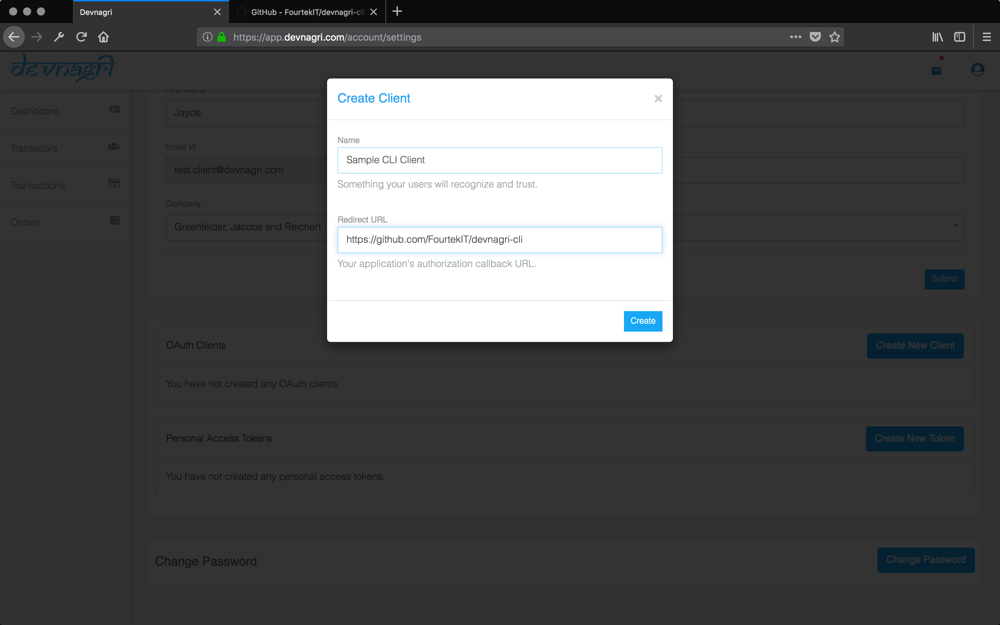

# devnagri-cli

This is the cross platform API client for Devnagri, written in Go-lang.

This has been developed to facilitate the integration of Devnagri localization platform with a Developer's workflow.

For developers who are more comfortable with the standard tools for eg. Android Studio for Android development, we are working on native plugins for such IDEs which will further simplify the usage of the Devnagri APIs.


## Installation

For using the `devnagri-cli` tool, the only thing that's required is for you to download the binary for your platform from the Github repository. The tool has been developed in `Go` so that there is no need to setup a language runtime in order to use localize your app.

Once downloaded you need to unzip the rar file and move the binary to your preferred location.

And that's it - you're all set to localize!


### Generating the Credentials 

#### Project Key

1. Go to Devnagri and log in to your Account. 
2. Select the project you wish to localize with the `devnagri` CLI tool.
3. Scroll down and click on *Generate Key*.


#### Cliend ID and Client Secret

1. Go to Devnagri and log in to your Account. 
2. Go to your account settings.
3. Scroll down till you find the *OAuth Clients* section.
4. Then click on *Create New Token* to generate the ID and Secret for the CLI client.

 

### Language codes used in Devnagri 
```
English     -       en
Hindi       -       hi
Punjabi     -       pa
Marathi     -       mr
Tamil       -       ta
Malayalam   -       ml 
Telugu      -       te
```


## What is YAML format ?

YAML format is a simpler alternative to JSON, which is used for specifying configurations. 

A point to be noted is that, *in YAML the whitespaces are significant*. This means you must be careful while adding and deleting the keys.

To ensure the validity of the format you can use the online validation service, generously offered by [Code Beautify - YAML validator](https://codebeautify.org/yaml-validator#)

## Usage in Terminal

### Invocation

    ```    
    > devnagri
    ```


## Usage Commands


### init

    ```    
    > devnagri init
    ```

This command initilizes the devnagri-cli **.devnagri.yaml** within the repository which consists of the following fields

```
    
## sample content of the .devnagri.yaml

ClientID:

ClientSecret:

ProjectKey:

RootDir: langs #default

Extension : xml #default

SourceLanguage: en #default

TargetLanguages:
    - hi 	#default

GlobalPreferenceInCaseOfMergeConflict: devnagri # default is devnagri.

```


### validate

Just validate the credentials

-   Send a sample request to devnagri to recieve the project-key [ generate this via browser ]
-   On local machine, validate the YAML file
    
    ```
    > devnagri validate
    ```

This command initiates a process 

-   To validate the **.devnagri.yaml** file
-   Sends a request to the devnagri and checks the credentials are authorized
-   Returns an access-token
-   This token is added to the **.devnagri.yaml**

NOTE: If you update the list of target languages, you don't need to validate the credentials again.

### version

    ```
    > devnagri version
    ```


### status

This command returns the translation status of the project

-   Project completion status
-   Total number of words
-   Translate words

    ```
    > devnagri status
    ```


### push

This command pushes the local files to devnagri

    ```
    > devnagri push
    ```


### pull

    ```
    > devnagri pull
    ```


### sync

This command synchronizes the files between the devnagri server and local environments

    ```
    > devnagri sync
    ```


### help

This command prints out the devnagri CLI help menu and prints a short summary of all the commands

    ```
    > devnagri help
    ```


### version

This command prints out the devnagri CLI version 

    ```    
    > devnagri version
    ```


